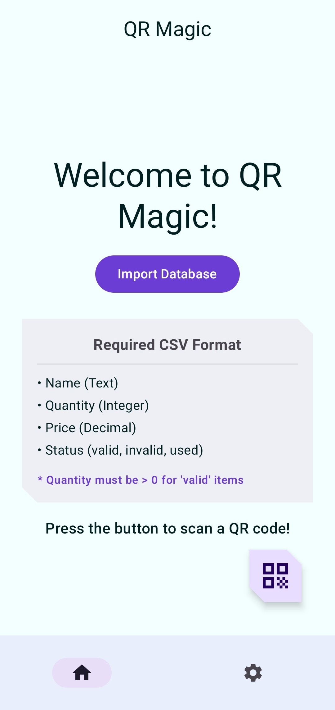
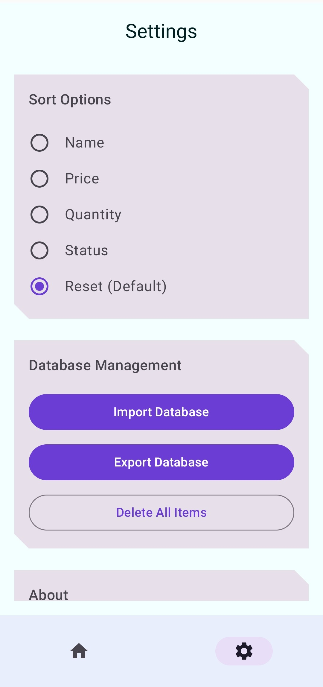
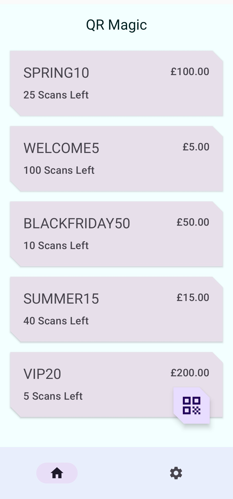
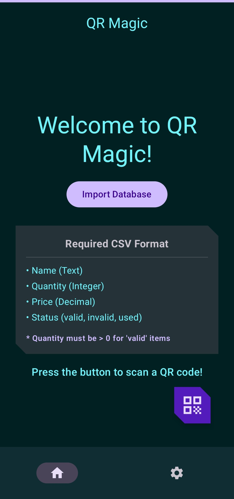
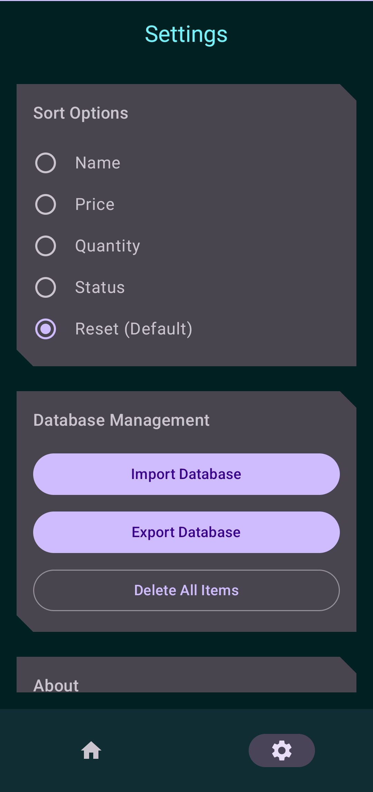

<div style="display:flex; align-items:center; justify-content:center; position:relative;">

  <div style="position:absolute; left:0;">
    
  </div>

  <div align="center">
    <h1>QR MAGIC</h1>
    <p style="font-size:20px; font-weight:500;">
      QR Code Scanner For Coupons (During Events)
    </p>
  </div>

</div>

<p align="center">
  
  
  
</p>

---


# Some Screenshots

<p align="center">
  
  
  
  
  
  
</p>

* Uses Google play services to scan QR codes (local scanning).
* You can import any text file (`.csv`, `.txt`, etc.) if they have the following format:
```
<NAME>,<QUANTITY>,<AMOUNT>,<STATUS>
```

* For example, A valid CSV file would be:
```
SPRING10,25,100.00,valid
WELCOME5,100,5.00,valid 
BLACKFRIDAY50,10,50.00,valid
SUMMER15,40,15.00,valid
VIP20,5,200.00,valid
```

* There are three possible values for `<STATUS>`: `valid`, `invalid`, `used`.

* When a QR code that does not already exist in the database is scanned it is `invalid`

* When a QR code's count/quantity becomes `0`, it will be `used`.

* Everything else is pretty intuitive, I hope.


* Duplicates when importing will be detected and merged if possible.
* See [test data](<./test data>) for more examples.

--- 
- Check [License](./LICENSE) 


* bye
